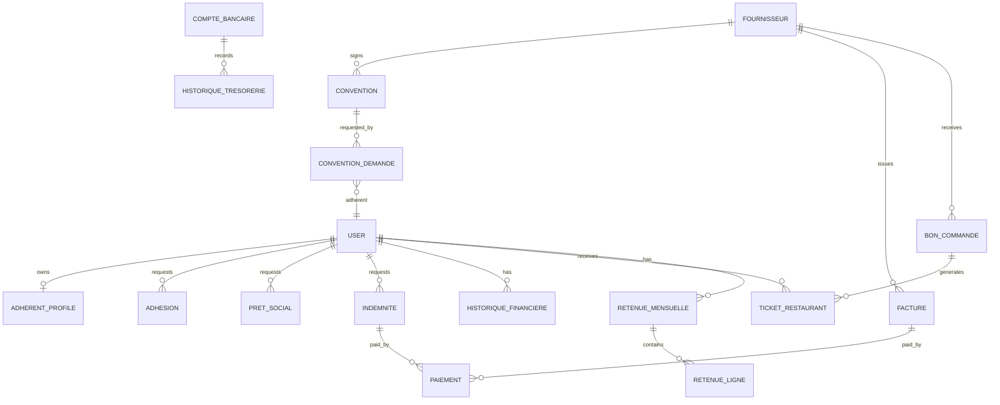

# Data Model

## Entity Relationship Overview

## Glossary

- Adherent: employee/member using the self-service portal.
- Adhesion: yearly membership request and status.
- Convention: agreement with a supplier that gives adherents a benefit.
- Convention demande: adherent request to use a convention.
- Retenue mensuelle: monthly deduction master generated for one adherent.
- Retenue ligne: one deduction line for adhesion, loan, convention, or ticket.
- Indemnite: social allowance requested by an adherent.
- Pret social: social loan requested by an adherent.
- Bon de commande: purchase order for tickets or supplier services.
- Ticket restaurant: restaurant/cafeteria ticket assigned to an adherent.
- Paiement: outgoing payment for invoice, indemnity, or other treasury flow.
- Historique tresorerie: treasury ledger movement.
